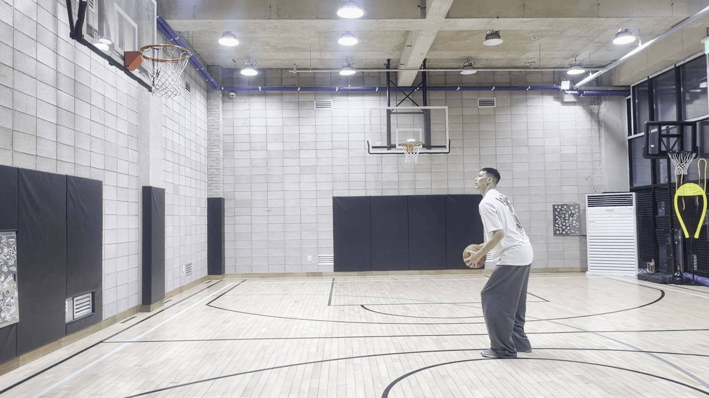
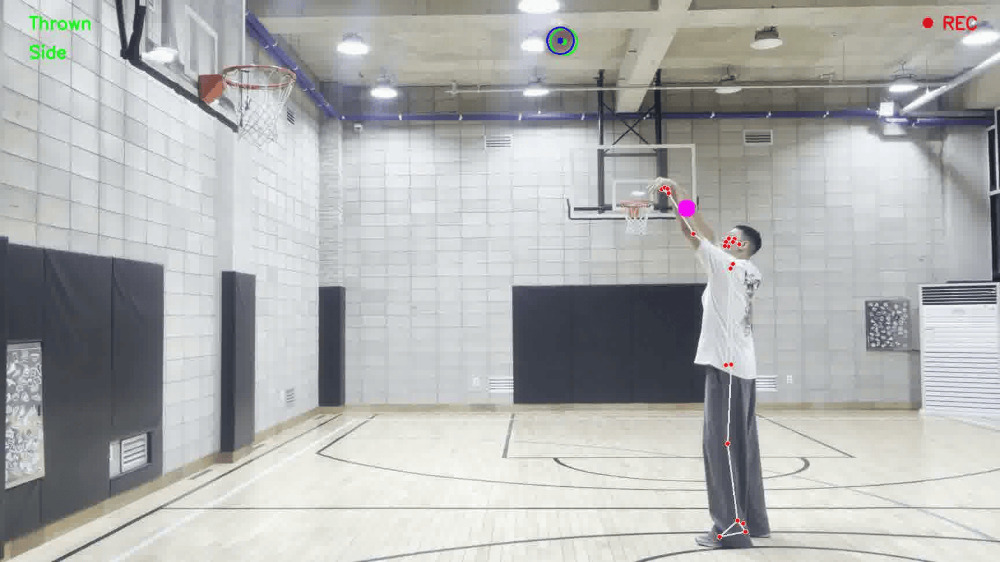
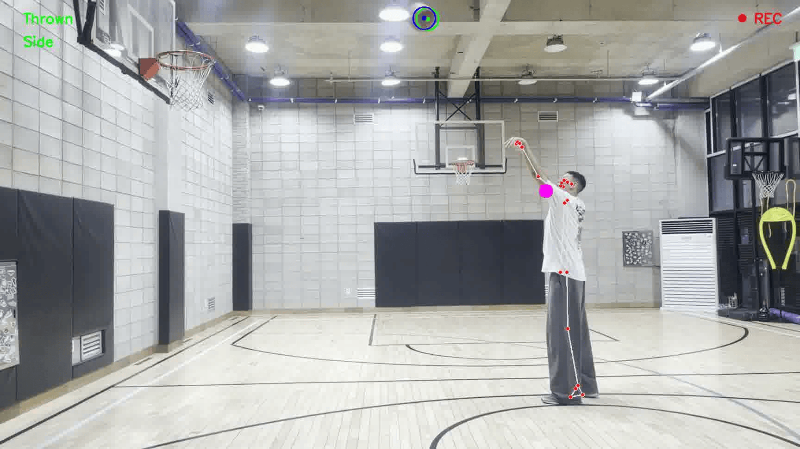
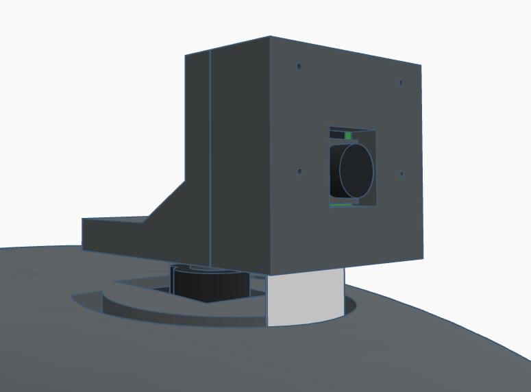

# AthletiQ

## Table of Contents
<ul>
  <li>
    <a href="#project-overview">Project Overview</a>
  </li><br>

  <li>
    <a href="#methodology">Methodology</a>
    <ul>
      <li><a href="#object-detection">Object Detection</a></li>
      <li><a href="#object-tracking">Object Tracking</a></li>
      <li><a href="#pose-detection">Pose Detection</a></li>
      <li><a href="#action-state-estimation">Action State Estimation</a></li>
      <li><a href="#camera-orientation--control">Camera Orientation & Control</a></li>
      <li><a href="#data-transmission">Data Transmission</a></li>
    </ul>
  </li><br>

  <li>
    <a href="#system-design">System Design</a>
    <ul>
      <li><a href="#hardware">Hardware</a></li>
      <li><a href="#functionality">Functionality</a></li>
      <li><a href="#communication">Communication</a></li>
    </ul>
  </li><br>

  <li>
    <a href="#installation--configuration">Installation & Configuration</a>
    <ul>
      <li><a href="#tested-environments">Tested Environments</a></li>
      <li><a href="#prerequisites">Prerequisites</a></li>
      <li><a href="#structure">Structure</a></li>
      <li><a href="#setup-raspberry-pi">Setup (Raspberry Pi)</a></li>
      <li><a href="#setup-mobile-device">Setup (Mobile Device)</a></li>
    </ul>
  </li><br>

  <li>
    <a href="#operating-instructions">Operating Instructions</a>
    <ul>
      <li><a href="#hardware-1">Hardware</a></li>
      <li><a href="#mobile-device">Mobile Device</a></li>
    </ul>
  </li>
</ul>


<br><br>

---

## Project Overview
This project implements an autonomous, real-time basketball shooting capture and analysis system.

A motorized camera mounted on stationary device continuously tracks a player on the court, keeping the athlete centered in the frame during the play.
The system processes a live video feed to detect shooting events and automatically triggers recording when a shot occurs.
Each captured clip includes both the shooting action and a short temporal window preceding the event.
The system then analyzes the clip to extract the player’s shooting pose and relevant motion features, and packages the results alongside the recorded video.

The processed video and structured analysis data are transmitted to a server and displayed on a web interface, enabling remote visualization and performance review.
The design emphasizes real-time operation, autonomous capture, and seamless integration between on-device perception and web-based presentation.

<br>


<br>

---

## Methodology
This framework implements a real-time basketball action detection and pose analysis pipeline using probabilistic object localization/tracking algorithm and Bayesian state estimation model.  
<br>

### Object Detection
The basketball is detected using a binary mask generated via HSV thresholding, with selective pixel-level enhancement applied beforehand.
An enhancement mask is first computed in the LAB color space and used to boost pixel values only in regions likely to correspond to the ball, improving robustness to lighting variations.
HSV thresholding is then applied to produce the final detection mask, focusing the enhancement on the target object.

The detection mask is further discretized through morphological operations to separate undesired regions into smaller segments, enabling the selection of the most ball-like contour.
To improve stability, sudden jumps in the detected position (measurement noises) are filtered out before passing the measurement to the tracking stage.

<br>

<p align="center"><em>Visualization of the detection pipeline:<br>camera frame - LAB enhancement mask - final HSV detection mask</em></p>
<br>

### Object Tracking
The basketball is recursively localized and tracked from the camera live feed using a Kalman filter, which combines motion priors with noisy visual measurements.
This approach ensures robust tracking, even during occlusions, out-of-frame scenarios, and missed detections.  
<br>

The algorithm for Kalman filter is implemented as below,  
  
$`1: \hspace{1cm} {\bf Algorithm\hspace{6pt}KalmanFilter(}\mu_{t-1}, \Sigma_{t-1}, u_t, z_t{\bf ):}`$  
$`2: \hspace{2cm} \bar{\mu}_t = A_t \mu_{t-1} + B_t u_t`$  
$`3: \hspace{2cm} \bar{\Sigma}_t = A_t \Sigma_{t-1} A^T_t + R_t`$  
$`4: \hspace{2cm} K_t = \bar{\Sigma}_t C^T_t (C_t \bar{\Sigma}_t C^T_t + Q_t)^{-1}`$  
$`5: \hspace{2cm} \mu_t = \bar{\mu}_t + K_t (z_t - C_t \bar{\mu}_t)`$  
$`6: \hspace{2cm} \Sigma_t = (I - K_t C_t) \bar{\Sigma}_t`$  
$`7: \hspace{2cm} \text{return }\hspace{6pt}\mu_t\hspace{1pt}\text{, }\hspace{2pt}\Sigma_t`$

where the subscript $`(\cdot)_k`$ refers to the current state, $`(\cdot)_{k-1}`$ corresponds to the previous state, and a bar $`\bar{(\cdot)}`$ denotes the belief (a priori).  
<br>

The variables are defined as:

- $\mu$ :&nbsp;&nbsp;&nbsp;state estimate  
- $\Sigma$ :&nbsp;&nbsp;&nbsp;estimate covariance matrix  
- $u$ :&nbsp;&nbsp;&nbsp;control input  
- $z$ :&nbsp;&nbsp;&nbsp;measurement  
- $A$ :&nbsp;&nbsp;&nbsp;state transition model  
- $B$ :&nbsp;&nbsp;&nbsp;control input model  
- $R$ :&nbsp;&nbsp;&nbsp;process noise covariance matrix  
- $K$ :&nbsp;&nbsp;&nbsp;Kalman gain  
- $C$ :&nbsp;&nbsp;&nbsp;observation model
<br>

The Algorithm for the Kalman filter can be divided into two main steps: **prediction** and **update**.  
The prediction step occurs before the measurement is taken into account (lines 2–3 in the algorithm above).  
Lines 4–6 correspond to the update step, where the predicted current state is corrected after incorporating the measurement.  
With no measurement or control, the zero matrix $O$ can be used.

$`1: \hspace{1cm} {\bf Algorithm\hspace{6pt}KalmanFilter(}\mu_{t-1}, \Sigma_{t-1}, O, O{\bf ):}`$  
$`2: \hspace{2cm} \bar{\mu}_t = A_t \mu_{t-1} + B_t u_t = A_t \mu_{t-1} + B_t O = A_t \mu_{t-1}`$  
$`3: \hspace{2cm} \bar{\Sigma}_t = A_t \Sigma_{t-1} A^T_t + R_t`$  
$`4: \hspace{2cm} K_t = \bar{\Sigma}_t C^T_t (C_t \bar{\Sigma}_t C^T_t + Q_t)^{-1} = \bar{\Sigma}_t O^T (O \bar{\Sigma}_t O^T + O)^{-1} = O`$  
$`5: \hspace{2cm} \mu_t = \bar{\mu}_t + K_t (z_t - C_t \bar{\mu}_t) = \bar{\mu}_t + O (O - O \bar{\mu}_t) = \bar{\mu}_t`$  
$`6: \hspace{2cm} \Sigma_t = (I - K_t C_t) \bar{\Sigma}_t = (I - O O) \bar{\Sigma}_t = I \bar{\Sigma}_t = \bar{\Sigma}_t`$  
$`7: \hspace{2cm} \text{return }\hspace{6pt}\mu_t\hspace{1pt}\text{, }\hspace{2pt}\Sigma_t`$  
<br>

Simply,

$`1: \hspace{1cm} {\bf Algorithm\hspace{6pt}KalmanFilterPrediction(}\mu_{t-1}, \Sigma_{t-1}{\bf ):}`$  
$`2: \hspace{2cm} \bar{\mu}_t = A_t \mu_{t-1}`$  
$`3: \hspace{2cm} \bar{\Sigma}_t = A_t \Sigma_{t-1} A^T_t + R_t`$  
$`4: \hspace{2cm} \mu_t = \bar{\mu}_t`$  
$`5: \hspace{2cm} \Sigma_t = \bar{\Sigma}_t`$  
$`6: \hspace{2cm} \text{return }\hspace{6pt}\mu_t\hspace{1pt}\text{, }\hspace{2pt}\Sigma_t`$  
<br>

To implement the algorithm in practice, all parameters must be derived from the system dynamics.
Accordingly, the physics of a moving ball is modeled as follows.

The current state of a ball can be expressed in terms of the position, velocity, and acceleration.

$$
\begin{aligned}
p_t &= p_{t-1} + v_t \Delta t + \frac{1}{2} a_t \Delta t^2\\
v_t &= v_{t-1} + a_t \Delta t
\end{aligned}
$$

But since the frame of the camera video is in 2-dimension, each parameter can be split into x and y coordinates.

$$
\begin{alignedat}{2}
&x_t = x_{t-1} + v_{x,t} \Delta t + \frac{1}{2} a_{x,t} \Delta t^2 \hspace{1cm} &&y_t = y_{t-1} + v_{y,t} \Delta t + \frac{1}{2} a_{y,t} \Delta t^2\\
&v_{x,t} = v_{t-1} + a_t \Delta t \hspace{1cm} &&v_{y,t} = v_{t-1} + a_t \Delta t
\end{alignedat}
$$

And also note that $\Delta t$ is the difference between each frames (1 frame), which can be substituted as 1.  
Therefore all the parameters can be expressed as matrices.

$$
\mu_t = \begin{bmatrix}
x_t & y_t\\
v_{x,t} & v_{y,t}
\end{bmatrix} =
\begin{bmatrix}
1 & 1\\
0 & 1
\end{bmatrix}
\begin{bmatrix}
x_{t-1} & y_{t-1}\\
v_{x,t-1} & v_{y,t-1}
\end{bmatrix} +
\begin{bmatrix}
\frac{1}{2}\\
1
\end{bmatrix}
\begin{bmatrix}
a_{x,t-1} & a_{y,t-1}
\end{bmatrix}
$$

$$
A = \begin{bmatrix}
1 & 1\\
0 & 1
\end{bmatrix}
$$

$$
\epsilon_t = \begin{bmatrix}
\frac{1}{2}\\
1
\end{bmatrix}
\begin{bmatrix}
a_{x,t-1} & a_{y,t-1}
\end{bmatrix} = G A_t^T \sim \mathcal{N} (0, R_t)
$$

$$
G = \begin{bmatrix}
\frac{1}{2}\\
1
\end{bmatrix}
\hspace{1cm}
R_t = \sigma^2 G G^T = \begin{bmatrix}
0.25 & 0.5\\
0.5 & 1
\end{bmatrix}
$$

$$
Z_t = \begin{bmatrix}
x_t & y_t
\end{bmatrix} = C_t \mu_t + \delta_t
= \begin{bmatrix}
1 & 0
\end{bmatrix}
\begin{bmatrix}
x_t & y_t\\
v_{x,t} & v_{y,t}
\end{bmatrix} + \delta_t
$$

$$
C_t = \begin{bmatrix}
1 & 0
\end{bmatrix}
$$

Also, $\mu_t$ and $\Sigma_t$ at $t=0$ are set to a $2 \times 2\hspace{2pt}$ zero matrices.  

$$
\mu_0 = \begin{bmatrix}
0 & 0\\
0 & 0
\end{bmatrix}
\hspace{1cm}
\Sigma_0 = \begin{bmatrix}
0 & 0\\
0 & 0
\end{bmatrix}
$$

<br>

#### Applications of Kalman Filter to Handle Noisy Measurements
When detections are temporarily unavailable, the Kalman filter continues to predict the object’s location.
Once measurements become available again, the estimate is corrected using the new observations.
- **Green Circle:** measurement obtained from detection
- **Blue Circle:** Kalman filter prediction, with or without a valid detection

<br>

<p align="center"><em>Missed detection due to lighting conditions and motion blur</em></p>
<br>

<p align="center"><em>Missed detection due to object being out of frame</em></p>
<br>

### Pose Detection
Player pose landmarks are extracted from the video feed using MediaPipe Pose, which provides a set of 3D body keypoints of the detected player.
These landmarks include essential joints of a person, such as shoulders, elbows, wrists, hips, etc.

<p align="center">
  
  <br>
  <em>MediaPipe pose landmarks</em>
</p>
<br>

### Action State Estimation
Shooting action recognition is formulated as a Hidden Markov Model with three hidden action states: 'Prep' ($\rho$), 'Set' ($\sigma$), and 'Thrown' ($\tau$).
Having binary observations and factorized features, the system uses a Bernoulli HMM with factorized emissions, and at each time step
(camera frame), online Bayesian filtering is performed via the HMM forward algorithm with a local Maximum a Posteriori (MAP) deterministic decision rule to infer the hidden states.
When the filtered posterior exhibits low confidence, a 1-step Viterbi-style local decoding  without backtracking is applied on the previously selected state to improve the consistency.

#### Hidden Markov Model Parameters
$`\mathcal{\lambda} \hspace{2pt} = \hspace{2pt} (\mathcal{S}, \mathcal{O}, \mathcal{\pi}, \mathcal{A}, \mathcal{B})`$  

- State Space:  
$`\mathcal{S} \hspace{2pt} = \hspace{2pt} \{\rho, \sigma, \tau\}`$


- Factorized Features:  
$`f_1, f_2, f_3 \hspace{2pt} \in \hspace{2pt} \{0,1\}`$


- Factorized Observation:  
$`\mathcal{O}' \hspace{2pt} = \hspace{2pt} (f_1, f_2, f_3)`$


- Observation Space:  
$`\mathcal{O} \hspace{2pt} = \hspace{2pt} \{\mathcal{O}' \hspace{4pt} | \hspace{4pt} f_k \in \{0,1\}, \quad k \in \{1,2,3\}\}`$


- Initial State Distribution:  
$`\pi \hspace{2pt} = \hspace{2pt} P(X_1 = s_i), \quad s_i \in \mathcal{S}, \quad i \in \{\rho, \sigma, \tau\}`$


- State Transition Model:  
$`\mathcal{A} \hspace{2pt} = \hspace{2pt} [a_{ij}], \quad a_{ij} \hspace{2pt} = \hspace{2pt} P(X_{t+1} = s_j \hspace{2pt} | \hspace{2pt} X_t = s_i), \quad i,j \in \{\rho, \sigma, \tau\}`$


- Factorized Emission Probability:  
$`\phi_{ik}(f_k) \hspace{2pt} = \hspace{2pt} Bernoulli(f_k \hspace{2pt} | \hspace{2pt} \theta_{ik}) \hspace{2pt} = \hspace{2pt} \theta_{ik}^{f_k}(1 - \theta_{ik})^{1-f_k}, \quad i \in \{\rho, \sigma, \tau\}, \quad k \in \{1,2,3\}`$


- Emission Probability Model:  
$`\mathcal{B} \hspace{2pt} = \hspace{2pt} [b_i(\mathcal{O}_t')], \quad b_i(\mathcal{O}_t') \hspace{2pt} = \hspace{2pt} P(\mathcal{O}_t' | X_t = s_i) \hspace{2pt} = \hspace{2pt} b_i(f_{1,t}, f_{2,t}, f_{3,t}) \hspace{6pt} =`$ $`\displaystyle \prod_{k=1}^{3}`$ $`\phi_{ik}(f_{k,t}), \quad i \in \{\rho, \sigma, \tau\}, \quad k \in \{1,2,3\}`$


<br>

#### Forward Algorithm Update
$`\alpha_1(j) \hspace{2pt} = \hspace{2pt} \pi_j \hspace{2pt}\cdot\hspace{2pt} \mathcal{B}_j(o_1)`$  


$`\alpha_t(j) \hspace{2pt} = \hspace{2pt} \mathcal{B}_j(o_t) \hspace{2pt}\cdot\hspace{2pt}`$ $`\displaystyle \sum_{i}^{\{\rho, \sigma, \tau\}}`$ $`\alpha_{t-1}(i) \hspace{2pt}\cdot\hspace{2pt} \mathcal{A}_{ij}`$  

#### Viterbi Algorithm Update
$`\delta_1(j) \hspace{2pt} = \hspace{2pt} \pi_j \hspace{2pt}\cdot\hspace{2pt} \mathcal{B}_j(o_1)`$  
$`\delta_t(j) \hspace{2pt} = \hspace{2pt} \mathcal{B}_j(o_t) \hspace{2pt}\cdot\hspace{2pt} \displaystyle \max_{i} [\delta_{t-1}(i) \hspace{2pt}\cdot\hspace{2pt} \mathcal{A}_{ij}]`$

#### State Selection
$`s_{\alpha, t} \hspace{2pt} = \hspace{2pt} \displaystyle \arg\max_j \alpha_t(j)`$  
$`s_{\delta, t} \hspace{2pt} = \hspace{2pt} \displaystyle \arg\max_j \delta_t(j)`$  

$`\displaystyle s_t =
\begin{cases}
s_{\alpha,t}, & \text{if confidence}_{\alpha,t} > \text{threshold} \\
s_{\delta,t}, & \text{otherwise}
\end{cases}
`$

<br>

### Camera Orientation & Control
Before starting the system, the user must place the device in either the front or side of the court, and press the push button to set the system mode (Front/Side) accordingly (shown on the hardware display).
In "Front mode", the camera is positioned directly under the basketball hoop facing the player to capture the shooting motion from the front, while in "Side mode", the camera is placed to the side of the player to capture the motion from a lateral perspective.
Camera orientation mode is determined by data received via UART serial communication and conditions the observation model.
The system also sends UART commands to rotate the camera when the player approaches the frame boundaries in order to constantly track and keep the player in frame.

<p align="center">
  
  <br>
  <em>Motorized Raspberry Pi Camera mounted on the device</em>
</p>
<br>

### Data Transmission
Upon detecting a shooting action, the system automatically records a video clip, including a short buffer of preceding frames, which is then encoded into a H.264 format.
The player’s shooting pose is analyzed and the results are serialized to a JSON file.
Both the encoded video clip and the analyzed data are transmitted to the server for web-based visualization.

<br>

---

## System Design
### Hardware
* Raspberry Pi 4 Model B (8GB RAM)
* Raspberry Pi Camera Module V2
* Arduino Uno R3
* MG90S Servo Motor
* 5-Digit 7-Segment Display
* Push Button
* 5V 3A Power Source

### Functionality
* Raspberry Pi 4 + Camera Module V2:
  * Real-time video capture
  * Image processing
  * Object tracking and localization; pose analysis; state estimation
  * Data analysis and server transmission
* Arduino Uno:
  * Servo control
  * Display control
  * Push button input sensing
* 7-Segment Display:
  * Visual feedback of the current mode (Front/Side)
* Push button:
  * Manual switching between camera mode (Front/Side)
* Power Source:
  * Power Raspberry Pi, Arduino, and servo motor
  * Display remaining battery
  * Power button to turn on/off the entire system

### Communication
* UART Communication Protocol
  * Raspberry Pi sends a start sync byte to Arduino; Arduino waits to ensure Raspberry Pi is ready and Wi-Fi is connected.
  * Arduino sends an ACK byte to Raspberry Pi to confirm synchronized start.
  * Raspberry Pi sends left/right commands to Arduino to rotate camera when player is near frame boundaries.
  * Arduino sends the current mode (Front/Side) to Raspberry Pi by sensing push button input.
* Server Data Transmission
  * Raspberry Pi uploads recorded video clips (H.264) and analyzed data (JSON) to Firebase Cloud Storage.

<br>

---

## Installation & Configuration
### Tested Environments
* Raspberry Pi 4 Model B (8GB) - Bullseye OS
* Arduino Uno R3
* Ubuntu 22.04
* Windows 10
* iOS 16.3.1
* Android 9
* Termius 6.3.0

### Prerequisites
```
# Core packages (strict version constraints for compatibility)
python             >= 3.9, <= 3.10
mediapipe          >= 0.10.5, <= 0.10.11
protobuf           >= 3.11, < 4.0
numpy              >= 1.23, < 2.0
matplotlib         >= 3.7, < 3.10
opencv-python      >= 4.7, <= 4.12
firebase-admin     >= 5.0, < 6.0
absl-py            >= 1.0, < 2.0
attrs              >= 21.3

# Flexible packages (no strict version required)
imutils
simplejpeg
av
python-dotenv
pyserial
picamera2
```

### Structure
```
/etc/
├── xdg/lxsession/LXDE-pi/
│   └── autostart
└── wpa_supplicant/
    └── wpa_supplicant.conf


/usr/local/bin/
└── uid


{ABSOLUTE_PATH_TO}/AthletiQ/
├── .env
├── .uid
├── main.py
├── utils.py
├── camera_source.py
├── object_localization.py
├── pose_detection.py
├── state_estimation.py
├── video_encoding.py
├── data_extraction.py
├── data_serialization.py
├── server_publication.py
├── serial.communication.py
│
├── firebase/
│   ├── cred/
│   │   └── <FIREBASE_ACCOUNT_KEY>.json
│   ├── downloads/
│   │   └── 000000/
│   │       ├── front/
│   │       │   ├── front.h264
│   │       │   └── front.json
│   │       └── side/
│   │           ├── side.h264
│   │           └── side.json
│   └── json/
│       ├── AthletiQ_JSON_Schema.json
│       ├── sample_front.json
│       └── sample_side.json
│
└── log/
    ├── main.log
    └── system.log
```
<br>

### Setup (Raspberry Pi)
**1. Create directories**
```bash
mkdir AthletiQ git
```
<br>

**2. Clone this repository**
```bash
cd git
git clone https://github.com/qkim96/AthletiQ.git
```
<br>

**3. Edit the configuration files**
```bash
cd AthletiQ
```
- Change {ABSOLUTE_PATH_TO}/ to actual absolute path to the project directory "AthletiQ/" (/home/<user_name>/)
```bash
nano autostart
```
- Change <YOUR_WIFI_NAME> and <YOUR_WIFI_PASSWORD> to your Wi-Fi (mobile device hotspot recommended)
```bash
nano wpa_supplicant.conf
```
<br>

**4. Move the configuration files to the appropriate location**
```bash
sudo mv autostart /etc/xdg/lxsession/LXDE-pi/
sudo mv wpa_supplicant.conf /etc/wpa_supplicant/
```
<br>

**5. Edit the bash file, move the file to the appropriate location, and set executable permission**
- Change {ABSOLUTE_PATH_TO}/ to actual absolute path to the project directory "AthletiQ/" (/home/<user_name>/)
```bash
nano uid
```
- Move the file
```bash
sudo mv uid /usr/local/bin
```
- Set executable permission
```bash
sudo chmod +x /usr/local/bin/uid
```
<br>

**6. Move all core files (including the hidden files) to the project directory**
```bash
mv src/main_code/AthletiQ_Pi/* src/main_code/AthletiQ_Pi/.* /home/<user_name>/AthletiQ/
```
<br>

**7. Download Firebase account key to /home/<user_name>/AthletiQ/firebase/cred/**
- Go to Firebase Console
- Select your project
- Go to service account (in project settings gear icon)
- Click "Generate new private key"
- Move the file to "/home/<user_name>/AthletiQ/firebase/cred/"
<br>

**8. Edit the environment variables file**
- Change {ABSOLUTE_PATH_TO}/ to actual absolute path to the project directory "AthletiQ/" (/home/<user_name>/)
- Change {FIREBASE_ACCOUNT_KEY} to the downloaded Firebase account key file name
- Change {FIREBASE_STORAGE_BUCKET_ID} to your Firebase storage bucket ID
```bash
cd /home/<user_name>/AthletiQ/
nano .env
```
<br>

### Setup (Mobile Device)
1. Install "Termius" app (from App Store, Google Play Store, etc.)
2. Login with Google, Apple account, etc.
3. Set password

<br>

---

## Operating Instructions
### Hardware
1. Turn on the device with the power button.
2. Wait for the display to show the current mode.

### Mobile Device
*Repeat the following steps when switching users*  

3. Open Termius app.
4. Select "Connections" tab at the bottom.
5. Search "ssh <rpi_username>@<rpi_hostname>.local" (or select recent connection).
6. Enter Raspberry Pi password.
7. Type "uid ######" (6-digit user ID from the web for "######").
8. Ready to use.
